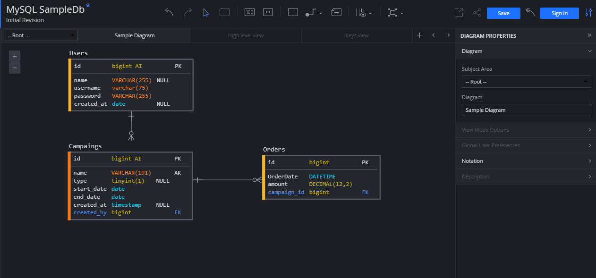

# Gapstars Code Test

### Summary 
Test has been implemented based on M-V-C architecture whereas best practices and design patterns. SOLID, PSR, Design Pattern.
You can find out the code file structure below.
####Used Design Pattern
Database class - Singleton / Open-closed Principle/ Dependency Inversion
Database connection can be change without touch the existing functionality.


## Deployment Instructions

```
// update the code to latest master branch
git pull origin main

// install with composer
php composer install --no-dev
```

### Development Instructions
```
// copy the database.php file
cp config/database.default.php config/database.php

// edit the database.php file with the dev environment database settings

```

Run PHP Development Sever
```
php -S localhost:8000
```

### Source Code Structure

```
Source Root
│-- README.md
│-- index.php    
│-- process.php    
│   
└───config - Database Configuration
│   │-- database.default.php
│   │  
└───src
│   │
│   └───Controllers
│   │   │-- Authentication.php
│   │   │-- BaseController.php
│   │   │-- SalesReport.php
│   │   
│   └───Entities
│   │   │-- Campaign.php
│   │   │-- User.php   
│   │   
│   └───Core
│       │-- Database.php
│       │-- MySQLConnection.php   
│       │
│       └───Contracts
│           │-- DatabaseConnectionInterface.php   
│           
└───Views
│   └───template
│   │    │-- header.php
│   │    │-- footer.php
│   │    
│   │-- login.php
│   │-- sales_report.php       
    
```
### Database Proposed Design - Sample
#### [Click here](public/database.sql) to download Database DDL File




### Improvement
Security Measures
* Use CSRF token - Cross-site Request Forgery 
* Sanitize input - Cross-site Scripting (XSS)
* Encryption / Password Hashing
* Throttle API requests for better throughput
